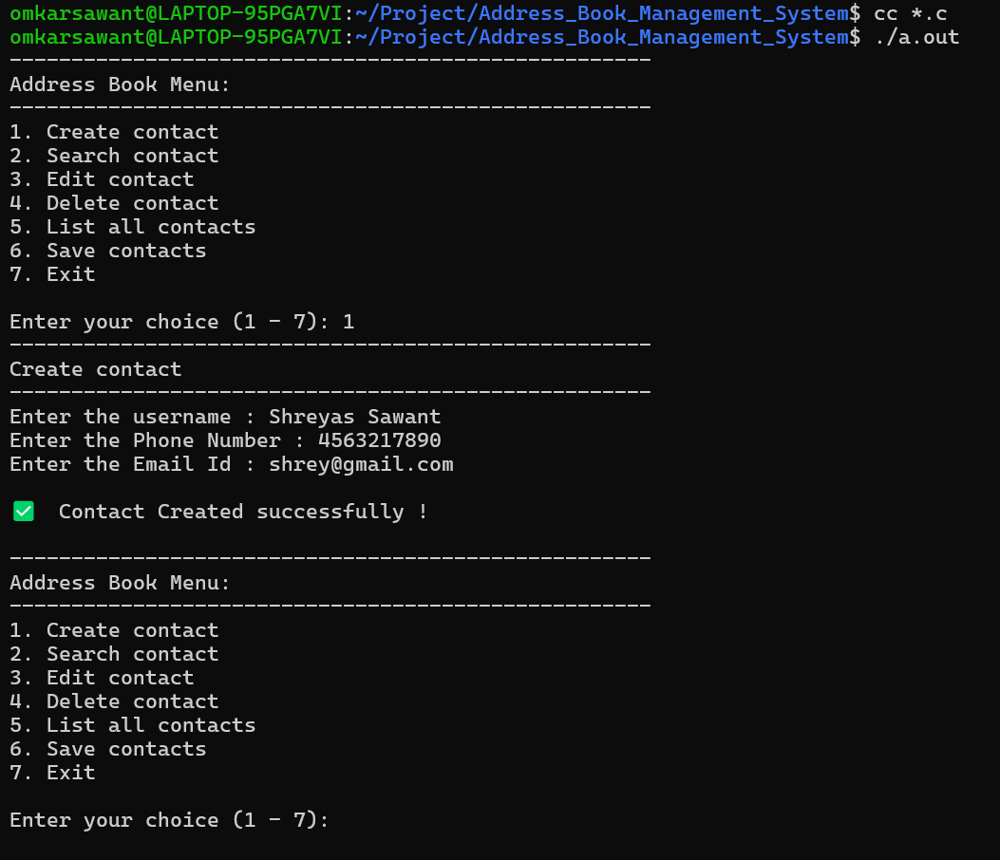
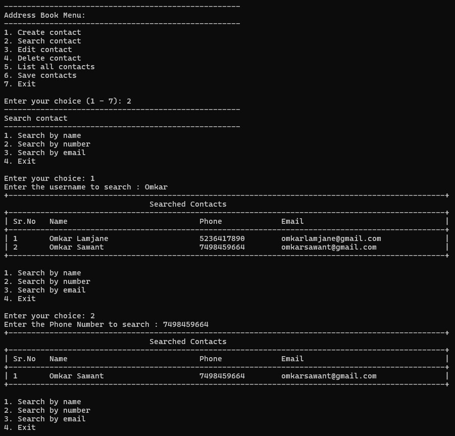
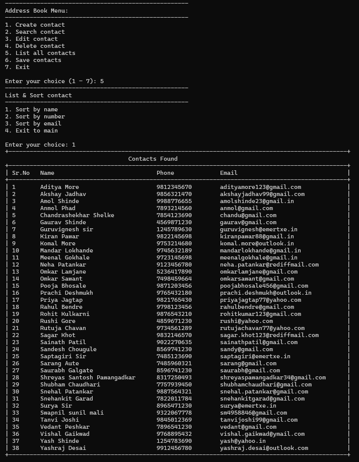
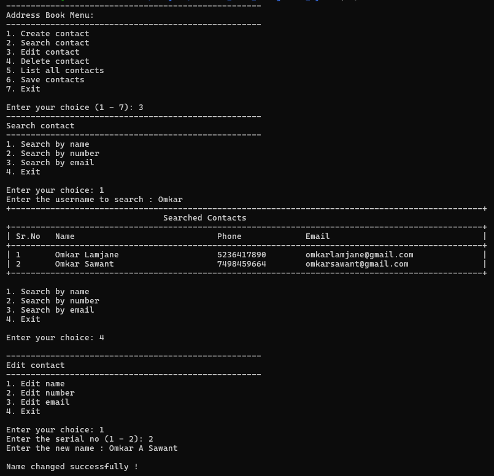
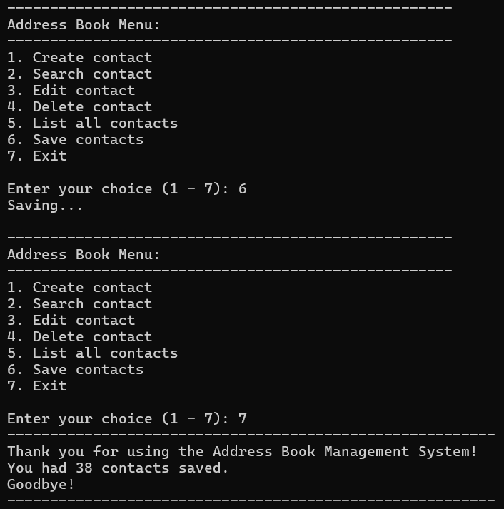

# 📘 Address Book Management System

A **menu-driven C application** for managing and organizing contact information efficiently.  
This project demonstrates **structured programming concepts**, **modular design**, and **persistent data handling** using file I/O.


---

## 🚀 Features

✅ **Create Contact** — Add new contacts with validation to ensure unique phone numbers and email addresses.  
🔍 **Search Contact** — Search by name, phone number, or email with **exact or partial match** options.  
✏️ **Edit & Delete** — Modify or safely remove existing contact entries.  
📋 **List All Contacts** — Display all saved contacts in a structured table view. Supports sorting by **Name**, **Number**, or **Email**.  
💾 **Persistent Storage** — Automatically saves all contact data to `contacts.csv` and loads it at startup.  

---

## 🛠️ How to Compile and Run

Follow these simple steps to get started:

### 1️⃣ Open a Terminal
Navigate to your project directory containing all source files.

### 2️⃣ Compile the Program
Use GCC to compile all source files:

```bash
gcc main.c contact.c searchSortEdit.c file.c -o addressbook
```

### 3️⃣ Run the Program
Execute the compiled file:

```bash
./addressbook
```

Once launched, the main menu will guide you through all operations.

---

## 📸 Program Outputs

Below are some sample screenshots showing different operations of the Address Book Management System:

### 🆕 Create Contact


### 🔍 Search Contact


### 📋 View All Contacts


### ✏️ Edit Contact


### 💾 Save & Exit



---

## 📂 Project Structure

| File | Description |
|------|--------------|
| **main.c** | Contains the main menu loop and controls overall program flow. |
| **contact.c / contact.h** | Defines the `Contact` structure and core logic for adding and validating contacts. |
| **searchSortEdit.c** | Implements searching, sorting, editing, and deleting functionalities. |
| **file.c / file.h** | Manages file operations for saving/loading data from `contacts.csv`. |
| **contacts.csv** | CSV file that stores all contact data persistently. |

---

## 🧱 Example Usage

```text
===============================
   ADDRESS BOOK MANAGEMENT
===============================
1. Create Contact
2. Search Contact
3. Edit Contact
4. Delete Contact
5. List All Contacts
6. Exit
Enter your choice: _
```

---

## 🧩 Concepts Demonstrated

- Modular Programming in C  
- File Handling (`fopen`, `fread`, `fprintf`, etc.)  
- Dynamic Data Management using Structures  
- Data Validation and String Manipulation  
- Menu-driven Console Interface  

---

## 🔮 Future Enhancements

- Contact grouping (e.g., Friends, Family, Work)  
- JSON or Binary File Storage options  
- Import/Export contact functionality  
- Enhanced UI with colors and formatting  
- Add backup and restore options  

---

## 👨‍💻 Author

**Omkar Sawant**  
📍 Bengaluru, Karnataka, India  
💼 [GitHub Profile](https://github.com/OmkarSawant25)  

---

⭐ **If you like this project, consider giving it a star on GitHub!**
